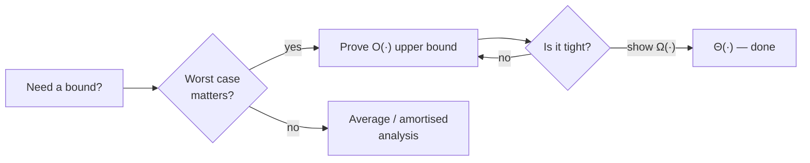

## Definitions

For functions $f, g : \N \to \R_{\ge 0}$:

::: definition Big-O
$f \in O(g)$ iff there exist $c > 0$ and $n_0$ such that $f(n) \le c\,g(n)$ for all $n \ge n_0$.
:::

$\Omega$ is the mirror lower bound, and $f \in \Theta(g)$ means both. Note what is *not* promised: nothing about small $n$, nothing about constants — an $O(n \log n)$ algorithm can lose to an $O(n^2)$ one on every input you will ever run.[^galactic]

[^galactic]: The extreme case: *galactic algorithms*, asymptotically optimal but useless below astronomical input sizes.

## Reading code

```python
def has_duplicate(xs):
    seen = set()
    for x in xs:          # n iterations
        if x in seen:     # O(1) expected
            return True
        seen.add(x)
    return False          # total: O(n) expected, O(n) space
```

Compare with the $O(n \log n)$ sort-first approach or the $O(n^2)$ nested loop — three points on the time/space trade-off curve for the same problem.

## A decision habit



The flowchart is the discipline: an upper bound alone is a claim about your *proof*, not about the algorithm. Tightness is a separate theorem. This connects directly to [[turing-machines|the machine model]] — asymptotics are only meaningful relative to a cost model.
